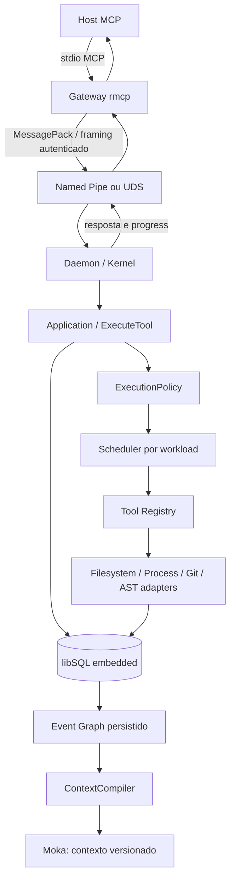

# Arquitetura

Domain não depende de Tokio, MCP, Serde, JSON, OS, banco ou cache. Ports definem
repositórios, Tool, filesystem, processos, Git, análise, relógio e contexto.
Application implementa orquestração sem conhecer tecnologia de armazenamento.
Infrastructure implementa os contratos e é vinculada apenas ao daemon.

O crate transport também pertence à infraestrutura tecnológica, mas é separado
para o gateway não importar o executor. APIs de leitura de segredo são
configuração do adapter IPC, nunca tools de workspace no gateway.

Scheduler usa uma admissão limitada por semaphore e limites independentes por
classe. Cada operação admitida mantém um slot até finalizar; filas de futures
são assim finitas sem um segundo buffer de jobs. mpsc limitado carrega progress,
JoinSet acompanha conexões IPC. O despacho não segura um lock global durante I/O.
Mutadores de arquivos compartilham um lock por workspace; leitores esperam por
fim/rollback de lote e não observam estado intermediário por essas tools.

I/O de IPC/processos é Tokio. cap-std, libgit2, tree-sitter e chamadas embedded
libSQL rodam em spawn_blocking, com limites antes do trabalho. Estado puro e
compilação de contexto são síncronos. Não há uma thread por async task.

Eventos de criação/conclusão, graph version e estado da operação são
transacionais. Journals de edição permitem restaurar o lado filesystem, que não
compartilha uma transação ACID com SQL. Resultado definitivo vem do banco;
progress perdido nunca representa perda de resultado.

Uma Tool adicionada ao Registry aparece no próximo tools/list sem alterar o
gateway. Não existe vector database nem sincronização cloud no caminho crítico.
