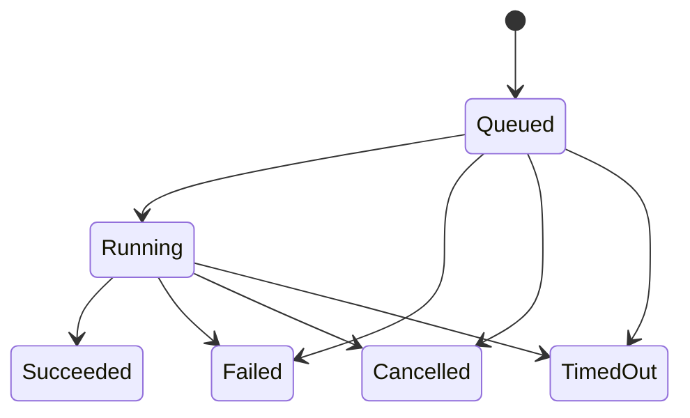

# Modelo de domínio

IDs próprios: WorkspaceId, TaskId, OperationId, ExecutionSessionId, ToolCallId,
EventId, ArtifactId, CheckpointId, ProcessId e TraceId. Encapsulam UUID; parsing
inválido gera DomainError. UUID não concede permissão por si só.

Workspace associa root registrado e graph_version. Task pertence ao workspace.
Operation carrega IDs, tool, input opaco, status, resultado e criação. ToolCall
registra invocação. Event preserva referência de operação e raw payload; EventNode
e EventEdge representam relações tipadas CausedBy, DependsOn, FollowedBy,
Mutated, Produced, RolledBackFrom. Artifact identifica produto/mutação de arquivo.
Checkpoint guarda somente os arquivos afetados, incluindo inexistência anterior.
ProcessHandle associa identidade interna, operação, workspace e PID quando existe.

Estados terminais não voltam a Running. Retry lê resultado persistido; outro
payload com o mesmo ID é Conflict. Cancelled não é Failed. Interrupção de crash
usa Failed com motivo explícito; nenhum efeito incompleto é reexecutado por retry.

Capabilities são enum; política é conjunto explícito de grants. Domínio não
inspeciona arquivos nem interpreta JSON. Tipos de event/summary são projeções
textuais atuais; ExecutionSession é um tipo de domínio, sem sessão persistida
separada no schema v1. Um workspace pode ter diversas tasks e operações.
