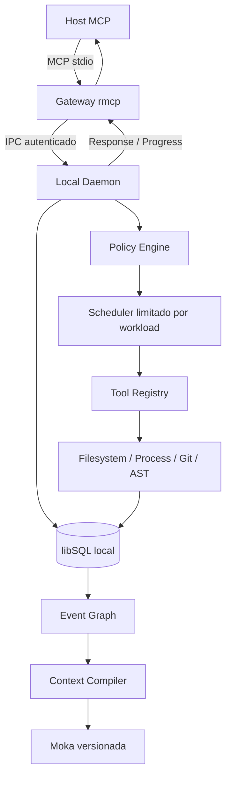

# RFC-0001 — remotecontroller: runtime local de execução para agentes

**Status:** arquitetura implementada; candidata v0.2 validada e publicada.
**Data:** 2026-09-30.
**Repositório:** https://github.com/Remote-Desktop-Controller/remotecontroller
**Plataformas:** baseline v0.1 passou no CI Windows/Linux/macOS; gates v0.2 em [readiness](../readiness/progress.md).

## Problema e objetivo

Hosts MCP precisam executar operações locais com isolamento de responsabilidades,
limites de recursos, autorização explícita e histórico recuperável. Acoplar a
execução ao processo MCP perde estado quando a conexão cai e mistura protocolo,
filesystem, processos e persistência.

O remotecontroller fornece um runtime nativo, local-first e independente de
Node.js, Python, Docker e serviços cloud para seu funcionamento principal. O
gateway adapta MCP; o daemon executa e mantém a fonte da verdade. Correção e
segurança precedem otimizações de performance.

## Escopo

Inclui filesystem, processos autorizados, leitura Git, análise estrutural
Rust/Python, operações canceláveis, checkpoints, recuperação, grafo de eventos e
compilação de contexto. Não define controle gráfico de mouse/teclado, desktop
remoto por rede, dashboard, execução irrestrita de shell ou cloud obrigatória.

## Arquitetura

| Componente | Responsabilidade |
|---|---|
| `crates/domain` | IDs próprios, entidades, estados e política pura |
| `crates/ports` | Contratos pequenos de repositórios e adapters |
| `crates/application` | Registry, autorização, execução, scheduler e cancelamento |
| `crates/protocol` | DTOs e envelopes IPC versionados |
| `crates/transport` | Named Pipes/UDS, framing, handshake e retry |
| `crates/infrastructure` | libSQL, Moka, filesystem, processos, Git, AST e composição |
| `apps/mcp-gateway` | Servidor MCP stdio e conversão de mensagens |
| `apps/local-daemon` | CLI, configuração e composição do runtime local |

Domain não importa MCP, Tokio, JSON, banco, cache ou APIs de plataforma. Tools
não conhecem MCP. O gateway não vincula o execution kernel. Diferenças de OS ficam
nos adapters. I/O assíncrono usa Tokio; CPU e chamadas bloqueantes ficam em workers.

## Contrato IPC

Windows usa Named Pipes; Linux/macOS usam Unix Domain Sockets. Não há TCP público.
O protocolo v1 usa MessagePack, com prefixo u32 big-endian e limite de 8 MiB.
Handshake exige versão compatível e segredo local de 32 bytes.

Metadata contém `protocol_version`, `request_id`, `trace_id`, `workspace_id`,
`task_id`, `operation_id` e `deadline` quando aplicável. Requests implementados:
Catalog, Heartbeat, Execute, GetOperation e Cancel. Eventos de progresso usam
buffer finito e podem ser coalescidos/descartados; resultado definitivo é durável.

Uma conexão atende um request. Retry de falha de I/O preserva o envelope e o
OperationId. O host pode fornecer `_meta.runtimeOperationId` em chamadas MCP
independentes. Mesmo ID com outro payload, tool, workspace ou task é Conflict.

STDOUT do gateway contém apenas protocolo MCP. Logs usam STDERR. Novas tools
são descobertas pelo catálogo do daemon sem alterar o gateway.

## Execução, concorrência e cancelamento

Fluxo: validar request/workspace/schema → autorizar capabilities → persistir
Queued → admitir/agendar → Running → executar → persistir resultado/eventos →
responder. Estados terminais: Succeeded, Failed, Cancelled e TimedOut.

Há limites separados para FileRead, FileWrite, Process, Database, Cpu e Background,
além de admissão finita. Fila cheia retorna Busy. Status/cancelamento têm caminho
de controle independente da admissão de trabalho. Não se abrem milhares de FDs.

Cancelamento propaga ao token da tool e ao filho/grupo/job quando existe.
Mutadores aguardam cleanup. Depois de commit confirmado, sucesso e checkpoint
permanecem disponíveis; cancelamento tardio não apaga o resultado. Falha de
cleanup prevalece sobre uma classificação meramente Cancelled.

## Persistência e memória causal

libSQL embedded local é SSOT, com WAL, synchronous FULL, foreign keys, migrations
versionadas e índices. Persistência é write-through; Moka não guarda a única
cópia de operação, evento ou checkpoint.

Tabelas principais: workspaces, tasks, operations, tool_calls, events, event_nodes,
event_edges, artifacts, checkpoints e processes. A criação/conclusão de operação,
eventos correspondentes e graph_version são transacionais.

Eventos preservam raw payload e representação resumida. Arestas distinguem
relações temporais e causais. A consulta causal atual usa travessia limitada,
deduplicada e parametrizada. Uma consulta anterior com recursive CTE apresentou
crash nativo reproduzido em benchmark Windows GNU e foi substituída; não se
atribui causa interna definitiva ao SDK sem depuração nativa.

ContextCompiler prioriza erros, mutações e eventos recentes, preserva referências
e respeita budget de bytes UTF-8. Queries de projeção não carregam raw BLOBs.
`context.event` permite recuperar a referência para auditoria. O cache tem
capacidade/TTL finitos e chave com workspace, graph_version, operação e budget;
a versão é conferida novamente antes de retornar.

## Escritas e recuperação

Uma escrita usa temporário no mesmo diretório, sync, replace atômico e verificação.
Lotes persistem snapshots dos arquivos afetados antes da primeira alteração.
Falha/cancelamento anterior ao commit restaura conteúdo e existência anteriores.
O journal permanece disponível para recuperação após crash.

Startup adquire lock de state-dir e endpoint antes de reconciliar estado,
restaura journals prepared do workspace, reconcilia processos e registra operações
interrompidas. Falha de restauração impede startup/admissão segura. Poison fence
é relido sob o lock de mutação. PIDs persistidos não são mortos cegamente após
restart, pois podem ter sido reutilizados.

## Segurança e modelo de confiança

Default permite leitura do workspace e GitRead. Escrita exige grant do operador.
cap-std confina acessos ao root e protege resolução de caminhos; há validação de
traversal, links/junctions, namespace/ADS, nomes reservados, tamanho e exclusões.
`.gitignore` é política imutável para tools, incluindo variantes de caixa Windows.

State-dir fica fora do workspace, com permissões privadas/ACL; o segredo IPC
nunca é logado. Named Pipes rejeitam clientes remotos. Um lock impede daemons
concorrentes reconciliando o mesmo banco.

Processos exigem executável absoluto e vetor exato de argumentos autorizados,
com normalização do path antes da comparação. Ambiente não herda segredos; shells
genéricos são rejeitados. Como não há sandbox OS completa, grants de acesso fora
do workspace e rede são explícitos. Job Objects/process groups gerenciam lifecycle;
não fornecem sandbox. Malware do mesmo usuário e administrador/SYSTEM estão fora
da garantia de isolamento deste v1. Git/parser hostil exige isolamento adicional.

## Catálogo v0.1.0

27 tools: filesystem read/read_range/list/search/stat/write/patch/batch_edit;
process spawn/status/stdout/stderr/kill; git status/diff/show; workspace info;
context recent/causal/compile/event; operation status/cancel; checkpoint
create/rollback; code inspect/symbols.

## Evidências e critérios de aceitação

Validação local: fmt, check, Clippy all-targets/all-features com -D warnings,
28 testes, compilação de benchmarks, oito benchmarks Criterion e build release.
Fullstack executa MCP real, mantém gateway durante restart e encerra abruptamente
daemon durante lote. Stress usa tempdirs com 10.000 arquivos e 1.000 edições,
cancelamento, novo lote, rollback, restart e conferência de todos os conteúdos.

Estimativas centrais medidas em Pentium 4417U / Windows GNU:

| Caso | Tempo |
|---|---:|
| IPC com handshake | 556.79 us |
| Cache hit / miss Moka | 627.22 / 405.03 ns |
| Event insert + commit | 15.911 ms |
| Consulta causal até 128 eventos | 5.5680 ms |
| Scan de 1.000 arquivos | 191.29 ms |
| Leitura de 100 arquivos | 17.435 ms |
| Context compiler de 128 eventos | 74.834 us |

Esses valores não são SLAs. Logs, escopo e falhas anteriores estão em
[validation](../validation.md) e [benchmarking](../benchmarking.md).

## Evolução e limites

A v0.2 implementa preservação de metadados suportados e precondições de rollback,
aprovação local com pin SHA-256, spool progressivo com quotas, guardian Unix,
contexto por task/query e rollups, manutenção explícita com backup/audit,
instalação/atualização local verificadas e bootstrap/registro de host. O gateway
permanece adapter; as três camadas lógicas não foram reescritas. Crates são unidades
de compilação, não camadas sequenciais nem microserviços.

Há limites explícitos: writes externos precisam de coordenação; hash antes do
rename não é CAS do kernel. Metadados/atributos não suportados são recusados;
snapshots legados alterados sem guard falham fechados. Processos confiáveis têm
grants explícitos de acesso não confinado; Job/guardian cuidam do ciclo de vida.
Certificado de editor/notarização dependem de credenciais externas. Checksums
conferem conteúdo sem criar identidade de editor fictícia.

O backlog a seguir registra o marco v0.1; os itens já implementados devem ser
avaliados pela matriz v0.2 e seus logs, não por esse registro histórico.

Antes de distribuição ampla: executar CI Linux/macOS, validar lifecycle Unix,
ampliar preservação de metadados/ACLs, política de captura/retention e assinatura
dos instaladores. O v1 mantém um workspace ativo por daemon, buffers de processo
limitados e snapshots de conteúdo/existência. Writers externos precisam de
coordenação. Ranking por intenção, rollups periódicos, GC, updater e instalador
assinado não estão implementados. Vector retrieval e cloud/licensing são opcionais
e devem permanecer fora do caminho crítico local.

ADRs detalham decisões de Rust/Tokio, separação gateway/daemon, IPC, libSQL,
Moka, grafo relacional, arquitetura hexagonal, concorrência, edits e segurança.
Este RFC registra o estado comprovado e a direção de evolução; não declara
validação multiplataforma ou garantias de sandbox ainda não demonstradas.
